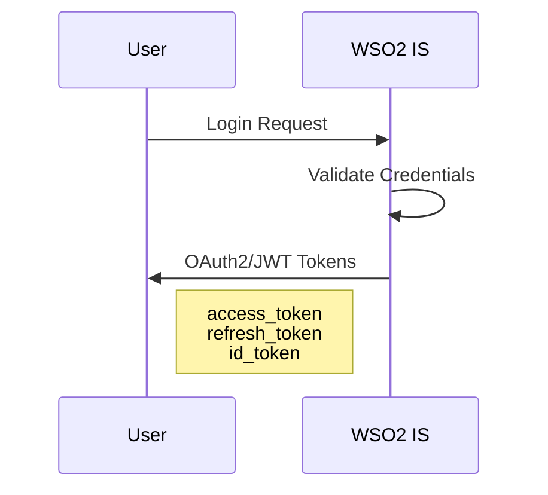
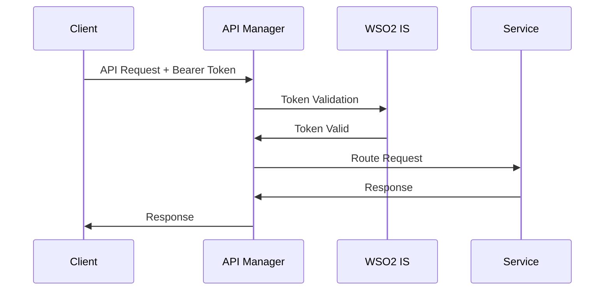

# Payment Platform

A complete Docker-based setup for **WSO2 API Manager 4.5.0** and **WSO2 Identity Server 7.1.0**, fully integrated with **PostgreSQL 18.0**.

> **Status:** Local development / evaluation. Harden before Internet exposure.

## 📋 Table of Contents

- [Overview](#overview)
- [Architecture](#architecture)
- [Prerequisites](#prerequisites)
- [Ports & Endpoints](#ports--endpoints)
- [Quick Start](#quick-start)
- [Project Structure](#project-structure)
- [Database Layout](#database-layout)
- [Health Checks & Verification](#health-checks--verification)
- [Troubleshooting](#troubleshooting)
- [Container Shell Access](#container-shell-access)
- [Configuration](#configuration)
- [Customization](#customization)
- [Security Notes](#security-notes)
- [Resources](#resources)
- [Version & Metadata](#version--metadata)

## 🎯 Overview

- **WSO2 API Manager 4.5.0** — Full-featured API lifecycle & gateway
- **WSO2 Identity Server 7.1.0** — Enterprise IAM (OAuth2/OIDC/SAML)
- **PostgreSQL 18.0** — Four databases (total 470 tables)
- **Automated setup** — First-run DB bootstrap + drivers
- **Operational hygiene** — Health checks, pooling, clean config

## 🏗️ Architecture

```
WSO2 API Manager 4.5.0                    WSO2 Identity Server 7.1.0
  ├── Publisher                             ├── My Account
  ├── Developer Portal                      ├── Console
  ├── API Gateway                           ├── OAuth2/SAML
  └── Management Console                    └── Management Console
         ▼                                           ▼
    apim_db (232 tables)                      identity_db (127 tables)
    shared_db (51 tables)                     shared_db_is (60 tables)
         └────────────────┬─────────────────────────┘
                          ▼
                PostgreSQL 18.0
            (4 databases, 470 tables total)
```

┌─────────────────────────────────────────────────────────┐
│                   WSO2 Services Stack                    │
├─────────────────────────────────────────────────────────┤
│ WSO2 API Manager (9443)  │  WSO2 Identity Server (9444) │
├──────────────────────────┴──────────────────────────────┤
│                    App Services Layer                    │
│  ├─ forex_service                                        │
│  ├─ ledger_service                                       │
│  ├─ payment_service                                      │
│  ├─ profile_service                                      │
│  ├─ rule_engine_service                                  │
│  ├─ wallet_service                                       │
│  └─ common                                               │
├─────────────────────────────────────────────────────────┤
│                   Data & Storage Layer                   │
│  ├─ PostgreSQL (5432)    - Relational DB                │
│  ├─ DynamoDB (8000)      - NoSQL DB                     │
│  ├─ Redis (6379)         - Cache/Sessions               │
│  └─ Redpanda (9092)      - Event Streaming              │
├─────────────────────────────────────────────────────────┤
│                 Observability Layer                      │
│  ├─ Jaeger (16686)       - Tracing UI                   │
│  └─ OTel Collector       - Telemetry Pipeline           │
└─────────────────────────────────────────────────────────┘

## 🔐 Authentication & Authorization

### Architecture Overview

```
User → WSO2 IS (OAuth2/OIDC) → Access Token
                                     ↓
External Client → WSO2 API Manager Gateway (Token Validation)
                                     ↓
              API Manager validates token with WSO2 IS Key Manager
                                     ↓
              Routes to internal microservices (gRPC/REST)
                                     ↓
              Services communicate internally via gRPC
```

### Layer Breakdown

#### **Layer 1: Identity & Access**
- **WSO2 Identity Server (9444)** - OAuth2/OIDC provider
  - User authentication, SSO, MFA
  - Token issuance (JWT/OAuth2)
  - Identity federation (SAML, OAuth2)

#### **Layer 2: API Gateway**
- **WSO2 API Manager (9443, 8280, 8243)**
  - Token validation via IS Key Manager
  - Rate limiting, throttling, transformation
  - API analytics and monitoring
  - Request/response mediation

#### **Layer 3: Microservices (Internal Communication)**
- **HTTP/REST**: External clients → API Gateway → Services
- **gRPC**: Service-to-service internal communication
- **Six services**: Forex, Ledger, Payment, Profile, Rule Engine, Wallet

#### **Layer 4: Data & Infrastructure**
- **PostgreSQL (5432)** - Relational data
- **Redis (6379)** - Caching/sessions
- **DynamoDB (8000)** - NoSQL data
- **Redpanda (9092)** - Event streaming
- **Jaeger (16686)** - Distributed tracing

### Authentication Flow

#### **1. User Authentication**



**Steps:**
1. User → Login Request → WSO2 IS
2. WSO2 IS validates credentials
3. WSO2 IS issues OAuth2/JWT tokens
4. Client receives: `access_token`, `refresh_token`, `id_token`

#### **2. API Request Flow**



**Steps:**
1. Client → API Request + Bearer Token → API Manager Gateway
2. API Manager → Token Validation → WSO2 IS Key Manager
3. WSO2 IS validates token signature, expiry, scopes
4. API Manager → Routes to backend service (with validated token)
5. Service → Processes request → Response
6. API Manager → Returns response to client

#### **3. Service-to-Service Communication**

```
Payment Service → gRPC call → Ledger Service
                            → Forex Service
                            → Wallet Service
                            → Rule Engine Service

(Internal gRPC uses mTLS, no token propagation needed)
```

**Characteristics:**
- **Protocol**: gRPC with Protocol Buffers
- **Security**: Mutual TLS (mTLS) between services
- **Discovery**: Service mesh or static configuration
- **Tracing**: OpenTelemetry for distributed tracing

### Token Types

| Token Type | Purpose | Lifetime | Storage |
|------------|---------|----------|----------|
| **Access Token** | API authorization | 1 hour | Memory only |
| **Refresh Token** | Renew access token | 30 days | Secure storage |
| **ID Token** | User identity info | 1 hour | Memory only |

### Security Features

#### **WSO2 Identity Server**
- ✅ OAuth 2.0 / OpenID Connect
- ✅ SAML 2.0 SSO
- ✅ Multi-Factor Authentication (MFA)
- ✅ Adaptive Authentication
- ✅ Fine-grained authorization

#### **WSO2 API Manager**
- ✅ JWT token validation
- ✅ OAuth2 scopes enforcement
- ✅ Rate limiting per token
- ✅ IP whitelisting/blacklisting
- ✅ Request/response transformation

#### **Microservices**
- ✅ gRPC with mTLS
- ✅ Service-level authorization
- ✅ Distributed tracing (Jaeger)
- ✅ Circuit breakers
- ✅ Request validation

### Common Utilities Structure

```
app_services/
├── common/                    # Shared utilities & middleware
│   ├── __init__.py
│   ├── auth/                  # JWT/OAuth2 validation
│   │   ├── jwt_validator.py
│   │   ├── oauth2_client.py
│   │   └── token_introspection.py
│   ├── grpc_client/           # gRPC client helpers
│   │   ├── base_client.py
│   │   └── interceptors.py
│   ├── middleware/            # FastAPI middleware
│   │   ├── auth_middleware.py
│   │   ├── logging_middleware.py
│   │   └── tracing_middleware.py
│   ├── observability/         # Logging, tracing
│   │   ├── logger.py
│   │   ├── metrics.py
│   │   └── tracer.py
│   └── utils/                 # Common helpers
│       ├── config.py
│       ├── exceptions.py
│       └── validators.py
└── protos/                    # gRPC protocol definitions
    ├── forex.proto
    ├── ledger.proto
    ├── payment.proto
    ├── profile.proto
    ├── rule_engine.proto
    └── wallet.proto
```

### Integration Points

#### **External → Platform**
```
Mobile/Web App
    ↓ (HTTPS + OAuth2)
WSO2 API Manager Gateway
    ↓ (Token Validation)
WSO2 Identity Server
    ↓ (Routing)
Microservices
```

#### **Service → Service**
```
Payment Service
    ↓ (gRPC + mTLS)
Ledger/Forex/Wallet Services
    ↓ (Events)
Redpanda Event Bus
```

#### **Service → Data**
```
Microservices
    ├─→ PostgreSQL (relational)
    ├─→ DynamoDB (NoSQL)
    ├─→ Redis (cache)
    └─→ Redpanda (events)
```

## ✅ Prerequisites

- **Docker** 20.10+
- **Docker Compose** 2.0+
- **RAM:** 8 GB minimum (16 GB recommended)
- **Disk:** 30 GB free
- **Ports:** Must be available (see below)

## 🌐 Ports & Endpoints

### Exposed Ports

`5432`, `8243`, `8280`, `9443`, `9444`, `9764`, `9999`, `11111`, `5005`

### WSO2 API Manager

| Interface | URL |
|-----------|-----|
| Management Console | https://localhost:9443/carbon |
| Publisher | https://localhost:9443/publisher |
| Developer Portal | https://localhost:9443/devportal |

### WSO2 Identity Server

| Interface | URL |
|-----------|-----|
| Management Console | https://localhost:9444/carbon |
| My Account | https://localhost:9444/myaccount |
| Console | https://localhost:9444/console |

### Default Credentials

- **Username:** `admin`
- **Password:** `admin`

### Container Names

- `postgres-wso2`
- `wso2am`
- `wso2is`

## 🚀 Quick Start

```bash
# 1) Start everything (foreground)
docker compose up --build

# or detached
docker compose up -d --build

# 2) Wait ~2–4 minutes for health checks to pass, then open the URLs above.

# 3) Stop
docker compose down

# (Optional) Full reset (removes volumes)
docker compose down -v
```

## 📁 Project Structure

```
wso2services/
├── docker-compose.yml                 # Main orchestration file
├── README.md                          # This file
├── conf/postgres/scripts/
│   ├── 01-init-databases.sql          # 4 databases + user
│   ├── 02-shared-db-schema.sql        # APIM shared (51 tables)
│   ├── 03-apim-db-schema.sql          # APIM data (232 tables)
│   ├── 04-identity-db-schema.sql      # IS identity (127 tables)
│   └── 05-shared-db-is-schema.sql     # IS shared (60 tables)
├── wso2am/
│   ├── Dockerfile
│   ├── conf/deployment.toml           # PostgreSQL config
│   └── lib/postgresql-42.7.4.jar
├── wso2is/
│   ├── Dockerfile
│   ├── conf/deployment.toml           # PostgreSQL config
│   └── lib/postgresql-42.7.4.jar
├── otel/
│   ├── Dockerfile
│   └── collector.yaml                 # OpenTelemetry config
└── app_services/
    ├── common/                        # Shared utilities
    ├── forex_service/                 # Currency exchange service
    ├── ledger_service/                # Transaction ledger
    ├── payment_service/               # Payment orchestration
    ├── profile_service/               # User profiles & KYC
    ├── rule_engine_service/           # Business rules engine
    └── wallet_service/                # Digital wallet management
```

## 🗄️ Database Layout Postgres ( WSO2 API Manager & Identity Server )

| Database | Tables | Purpose |
|----------|--------|---------|
| **apim_db** | 232 | API Manager data |
| **shared_db** | 51 | API Manager shared (users, registry) |
| **identity_db** | 127 | Identity Server data |
| **shared_db_is** | 60 | Identity Server shared (users, registry) |

**Why separate shared DBs?**  
AM and IS have different user/registry schemas—separating avoids conflicts.

**DB user (default):** `wso2carbon` / `wso2carbon`

## 🚀 Application Services

### Microservices Architecture

The platform includes 6 FastAPI-based microservices:

| Service | Port | Description | Key Features |
|---------|------|-------------|-------------|
| **forex-service** | 8001 | Currency exchange rates | Real-time FX data, multi-currency support |
| **ledger-service** | 8002 | Transaction ledger | Double-entry accounting, audit trail |
| **payment-service** | 8003 | Payment orchestration | Multi-service coordination, workflows |
| **profile-service** | 8004 | User profiles & KYC | Identity verification, compliance |
| **rule-engine-service** | 8005 | Business rules | Risk scoring, compliance checks |
| **wallet-service** | 8006 | Digital wallets | Balance management, transactions |

### Technology Stack

#### **Core Framework**
- ✅ **FastAPI 0.119.0+** - Latest with Pydantic v2 support
- ✅ **Uvicorn with standard** - ASGI server with websockets, httptools
- ✅ **Pydantic 2.10.0+** - Data validation (v2 only for Python 3.14)
- ✅ **Pydantic Settings 2.6.0+** - Environment configuration

#### **Infrastructure Clients**
- ✅ **psycopg[binary] 3.2.0+** - PostgreSQL async driver
- ✅ **aioboto3 13.2.0+** - DynamoDB async client
- ✅ **redis[hiredis] 5.2.0+** - Redis with C parser
- ✅ **aiokafka 0.11.0+** - Redpanda/Kafka async client
- ✅ **httpx 0.28.0+** - Async HTTP client

#### **Observability Stack**
- ✅ **OpenTelemetry API 1.28.0+** - Tracing/metrics API
- ✅ **OpenTelemetry SDK 1.28.0+** - Implementation
- ✅ **FastAPI Instrumentation** - Auto-tracing for FastAPI
- ✅ **OTLP Exporter** - Sends to Jaeger/OTel Collector

#### **Security & Auth**
- ✅ **python-jose[cryptography]** - JWT token handling
- ✅ **passlib[bcrypt]** - Password hashing
- ✅ **python-multipart** - Form/file upload support

#### **Testing**
- ✅ **pytest 8.3.0+** - Testing framework
- ✅ **pytest-asyncio** - Async test support

### API Documentation

Each service provides auto-generated API documentation:

- **Swagger UI**: `http://localhost:800X/docs`
- **ReDoc**: `http://localhost:800X/redoc`
- **OpenAPI JSON**: `http://localhost:800X/openapi.json`

(Replace `X` with service port number 1-6)

### Service Dependencies

```
payment-service
├── Depends on: forex-service, ledger-service, wallet-service, rule-engine-service
├── Database: PostgreSQL (payment_db), Redis (DB 2)
└── Events: Publishes to Redpanda

wallet-service
├── Depends on: ledger-service
├── Database: PostgreSQL (wallet_db), Redis (DB 5)
└── Events: Publishes to Redpanda

profile-service
├── Depends on: WSO2 Identity Server
├── Database: PostgreSQL (profile_db), Redis (DB 3)
└── Integration: OAuth2/OIDC with WSO2 IS
```

## 🔍 Health Checks & Verification

### Check Service Status

```bash
# View all container status
docker compose ps

# Check specific service health
curl http://localhost:8001/health  # Forex service
curl http://localhost:8002/health  # Ledger service
curl http://localhost:8003/health  # Payment service
curl http://localhost:8004/health  # Profile service
curl http://localhost:8005/health  # Rule engine
curl http://localhost:8006/health  # Wallet service

# Check WSO2 services
curl -k https://localhost:9443/carbon/  # API Manager
curl -k https://localhost:9444/carbon/  # Identity Server

# Check infrastructure
curl http://localhost:16686/  # Jaeger UI
```

### View Logs

```bash
# All services
docker compose logs -f

# Specific service
docker compose logs -f forex-service
docker compose logs -f wso2am
docker compose logs -f postgres
```

## 🐛 Troubleshooting

### Common Issues

**Services won't start**
```bash
# Check port conflicts
sudo lsof -i :9443  # API Manager
sudo lsof -i :8001  # Forex service

# Check disk space
df -h

# Check Docker resources
docker system df
```

**Database connection errors**
```bash
# Verify PostgreSQL is ready
docker compose exec postgres pg_isready -U postgres

# Check database exists
docker compose exec postgres psql -U postgres -l
```

**Build failures**
```bash
# Clean rebuild
docker compose down -v
docker compose build --no-cache
docker compose up -d
```

## 🔧 Container Shell Access

```bash
# PostgreSQL
docker compose exec postgres psql -U wso2carbon -d apim_db

# WSO2 API Manager
docker compose exec wso2am bash

# Application service
docker compose exec forex-service bash

# Redis CLI
docker compose exec redis redis-cli -a redis-secret
```

## ⚙️ Configuration

### Environment Variables

Services use environment variables for configuration (see `docker-compose.yml`):

- **DATABASE_URL** - PostgreSQL connection string
- **REDIS_URL** - Redis connection string
- **KAFKA_BOOTSTRAP_SERVERS** - Redpanda brokers
- **OTEL_EXPORTER_OTLP_ENDPOINT** - OpenTelemetry collector
- **WSO2_IS_URL** - Identity Server endpoint

### Customization

**WSO2 configurations**: Edit `wso2am/conf/deployment.toml` or `wso2is/conf/deployment.toml`

**Database schemas**: Modify SQL files in `conf/postgres/scripts/`

**Service code**: Update files in `app_services/<service_name>/app/`

## 🔒 Security Notes

> ⚠️ **WARNING**: This setup is for development/evaluation only. DO NOT expose to the internet without hardening.

### For Production:

1. **Change default passwords**
   - WSO2 admin credentials
   - PostgreSQL passwords
   - Redis password

2. **Enable SSL/TLS**
   - Configure proper certificates for WSO2 services
   - Enable TLS for PostgreSQL connections
   - Use Redis TLS mode

3. **Network security**
   - Use Docker secrets for sensitive data
   - Implement network segmentation
   - Add firewall rules

4. **Authentication**
   - Integrate OAuth2/JWT for API services
   - Enable mutual TLS between services
   - Configure WSO2 IS for centralized auth

## 📚 Resources

- **WSO2 API Manager Docs** — https://apim.docs.wso2.com/
- **WSO2 Identity Server Docs** — https://is.docs.wso2.com/
- **PostgreSQL Docs** — https://www.postgresql.org/docs/
- **FastAPI** — https://fastapi.tiangolo.com/
- **Docker Compose** — https://docs.docker.com/compose/
- **OpenTelemetry** — https://opentelemetry.io/

## 📝 Version & Metadata

| Component | Version |
|-----------|----------|
| WSO2 API Manager | 4.5.0 |
| WSO2 Identity Server | 7.1.0 |
| PostgreSQL | 18.0 |
| Python | 3.14 |
| FastAPI | 0.119.0+ |
| Redis | 8.2.2 |
| Redpanda | v25.2.9 |
| DynamoDB Local | Latest |
| Jaeger | Latest |

**Last Updated:** October 14, 2025

---

**Total Service Count:** 14 Services
- 2 WSO2 Services (API Manager, Identity Server)
- 6 Application Services (FastAPI microservices)
- 6 Infrastructure Services (PostgreSQL, Redis, DynamoDB, Redpanda, Jaeger, OTel Collector)